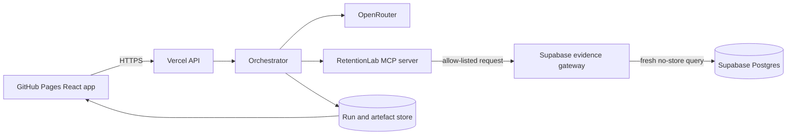

# Architecture baseline

## Product boundary

RetentionLab has two deliberately connected surfaces:

- Case Theatre: an internal customer-success workspace that shows the live evidence, five-agent handoff and trust decisions.
- Recovery Room: the Maker-produced customer-facing recovery artefact where a fictional customer can review and respond to recovery options.

## Runtime topology



## Five-stage artefact chain

Every stage accepts one typed artefact envelope and produces the next version. The envelope records the run, stage, prompt version, model identifier, source artefacts, evidence references, timestamps and validation result.

```text
ResearchBrief
  → RecoveryDesignSpecification
  → RecoveryRoomArtefact
  → CommunicationPlan
  → ManagerOperationalDecision
```

No stage can be called successfully when its required predecessor has not passed schema validation.

## Orchestration (Gate 9)

The `agents/orchestrator` backbone sequences the five runtimes through a pure state machine over an
append-only, hash-chained JSONL event log (slice 1). Slice 2 composes the five REAL runtimes as
injected stage executors and adds crash-safe live persistence:

- Every typed artefact is written under one run-owned directory as `<stage>.<name>.v<version>.json`
  with exclusive creation; SHA-256 references use the repository compact schema-parsed JSON convention,
  identical to the digests each downstream runtime embeds for lineage.
- On resume, each executor reloads and re-hashes its durable predecessor artefacts from disk (never
  from process memory) and fails closed if a predecessor disagrees with the committed orchestration
  state.
- At the active-stage crash boundary an executor may adopt a valid unsealed artefact written just
  before the crash — but only after schema validation, exact run/account/stage/version and predecessor
  lineage checks and a hash recomputation; otherwise it fails closed. An exact durable output is
  adopted without spending another model call. On a revision rerun the `REVISION_UNSUPPORTED` guard
  runs before any adoption, so a leftover valid artefact at the target version is never adopted as an
  applied revision.
- The real `ManagerOperationalDecision` is projected through `deriveManagerOutcome` and sealed by the
  atomic `manager_decided` event. A completed approval halts at `awaiting_human_approval` and triggers
  no send, publish, deploy, data mutation or external customer action.
- A local exclusive `run.lock` prevents concurrent writers for a run; stale-lock recovery is
  conservative (same host + provably dead pid only). Each holder stamps a random ownership token and
  `release` unlinks only when that token still matches, so it will not delete a lock a later reclaim
  already replaced. This is best-effort, not race-proof: read/compare/unlink is a filesystem TOCTOU, so
  an external or manual replacement landing between the comparison and the unlink can still be removed —
  the token check narrows that window, it does not close it. Reclamation of a dead same-host lock is
  likewise best-effort (not fully serialized). The exclusive-create artefact writes and the verified
  hash-chained event replay are the real single-writer backstop.
- A deterministic, source-backed transcript (JSON + Markdown) is exported from the parsed artefacts and
  the verified event log as immutable, state-versioned snapshots (exclusive creation; named from
  status + event count + final chain hash) that are never overwritten; construction is pure and
  separated from I/O.

- A run stalled at `failed` can be recovered by an explicit, append-only, operator-initiated retry of
  the failed stage (`Orchestrator.retryFailed` / `--retry-failed <run-id>`). The single
  `failed_stage_retry_requested` event — never emitted automatically — is accepted only when the run is
  `failed` at exactly that stage with every predecessor completed and every downstream stage still
  pending/invalidated; it moves the failed stage to `invalidated` (rerun at attempt/version +1),
  preserves all history including the failure event, carries no fabricated Manager `required_changes`,
  and returns the run to `in_progress`. A Manager approval/rejection outcome (`awaiting_human_approval` /
  `rejected`) is never `failed`, so this path can never retry a human-governance decision. The transcript
  records the failure and its bounded operator reason so the failure is never hidden.

The `agent:pipeline` CLI starts a fresh UUID run, resumes an explicit run id, or recovers a failed run
with `--retry-failed <run-id>` (a distinct mode that requires an existing event log and never
bootstraps a genesis event). Resume is bootstrap-safe:
a crash after `run-input.json` is written but before the genesis event leaves run input with no event
log, and the testable `resumeExplicitRun` helper bootstraps `orchestrator.start` from the immutable run
input (fail-closed on a run-id mismatch) rather than failing `RUN_NOT_FOUND`; it never overwrites run
input or an event log. A Manager revision rerun currently fails closed rather than fabricate applied
`required_changes`; the bounded typed revision path and the live full-pipeline transcript are proven
only by the accepted live run.

## Security boundary

- Public frontend: display and interaction only; publishable Supabase values are accessed through the server.
- Vercel API: rate limits, schema validation, orchestration and model calls.
- MCP server: allow-listed read tools with structured responses and source timestamps.
- Supabase evidence gateway: deployed Edge Function with a fixed tool allow-list, strict input validation and no cached fallback.
- Supabase clarification gateway: separate write-only Edge Function with exact-origin CORS, strict
  payload/receipt contracts, idempotency and a short-lived single-use recovery capability that is
  removed from the URL before live evidence is rendered.
- Supabase: fictional records, row-level security, internal secret-key access and no real customer PII.

Clarification records live in a non-exposed `private` schema. Browser roles have no schema, table
or RPC grants. The Edge Function hashes the capability, and a service-only security-definer RPC
atomically verifies the current synthetic account, generation run, open medium-severity workflow
case and recovery-outreach preference before consuming the capability and writing one submission.

## Frontend information architecture

The accepted Case Theatre uses six case tabs without a dashboard/sidebar pattern:

1. Pulse
2. Organisation
3. Evidence
4. Recovery Room
5. Trust Gate
6. Audit

The living case artefact is central, the five agents orbit it, and only one agent detail is expanded at a time. The bottom Manager dock provides cited, read-only explanations.
