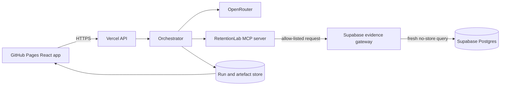

# Architecture baseline

## Product boundary

RetentionLab has two deliberately connected surfaces:

- Case Theatre: an internal customer-success workspace that shows the live evidence, five-agent handoff and trust decisions.
- Recovery Room: the Maker-produced customer-facing recovery artefact where a fictional customer can review and respond to recovery options.

## Runtime topology



## Five-stage artefact chain

Every stage accepts one typed artefact envelope and produces the next version. The envelope records the run, stage, prompt version, model identifier, source artefacts, evidence references, timestamps and validation result.

```text
ResearchBrief
  → RecoveryDesignSpecification
  → RecoveryRoomArtefact
  → CommunicationPlan
  → ManagerOperationalDecision
```

No stage can be called successfully when its required predecessor has not passed schema validation.

## Security boundary

- Public frontend: display and interaction only; publishable Supabase values are accessed through the server.
- Vercel API: rate limits, schema validation, orchestration and model calls.
- MCP server: allow-listed read tools with structured responses and source timestamps.
- Supabase evidence gateway: deployed Edge Function with a fixed tool allow-list, strict input validation and no cached fallback.
- Supabase: fictional records, row-level security, internal secret-key access and no real customer PII.

## Frontend information architecture

The accepted Case Theatre uses six case tabs without a dashboard/sidebar pattern:

1. Pulse
2. Organisation
3. Evidence
4. Recovery Room
5. Trust Gate
6. Audit

The living case artefact is central, the five agents orbit it, and only one agent detail is expanded at a time. The bottom Manager dock provides cited, read-only explanations.
