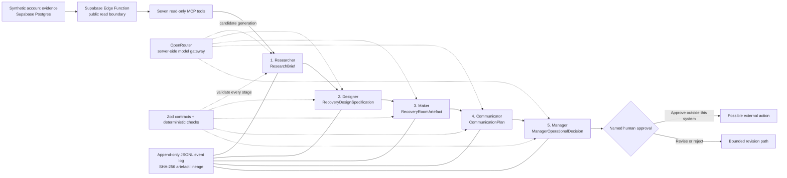

# RetentionLab project handbook

This is the plain-language technical story behind the project. Use it to learn the system, prepare the live demonstration and explain your design decisions in a viva or interview. Do not memorise it word for word: be able to redraw the flow and explain why every boundary exists.

## The 30-second explanation

RetentionLab is a consent-first agentic organisation for customer retention. It investigates one fictional B2B SaaS account using live product, billing, support and consent evidence. Five specialised AI agents then transform that evidence in a fixed order into a researched brief, a recovery design, a functional Signal Garden artefact, a bounded communication plan and a governed management decision. Every handoff is validated, hash-linked and recorded. The organisation can recommend a recovery action, but it cannot contact a customer, publish, deploy or mutate customer data: the final step is always approval by a named human.

## Why the project exists

Customer-retention teams often have plenty of data but weak coordination. Product usage may fall, a support case may carry negative sentiment, a renewal may approach and consent may permit only certain channels. If these facts live in separate tools, teams can act too late or take an action the evidence and consent do not support.

RetentionLab treats that as an organisational problem, not merely a prediction problem. It creates accountable specialists with narrow responsibilities and a traceable handoff between them. This is why the project is an **agentic organisation**, not one chatbot with five character names.

## System map

The key architectural idea is that the language model proposes a candidate, while the runtime owns identity, permissions, schema validation, evidence integrity, consent inheritance and stage order. A fluent model answer is not accepted merely because it looks correct.

## The five specialists

| Order | Agent | Responsibility | Typed output | What it cannot do |
|---|---|---|---|---|
| 1 | Researcher — Nia Calder | Query fresh allow-listed evidence, distinguish observation from uncertainty and find supported retention risks | `ResearchBrief` | Invent evidence or make a customer decision |
| 2 | Designer — Luca Moretti | Convert the sealed brief into an accessible, consent-aware recovery journey | `RecoveryDesignSpecification` | Add facts absent from the brief or weaken consent boundaries |
| 3 | Maker — Noor Patel | Build the Signal Garden artefact and prove implemented regions, claims, states, tests and commit | `RecoveryRoomArtefact` | Claim a feature without implementation evidence |
| 4 | Communicator — Maeve Quinn | Draft source-backed, channel-bounded outreach | `CommunicationPlan` | Send, schedule or create automatic follow-up |
| 5 | Manager — Elias Grant | Verify the complete chain and approve, revise or reject it for human consideration | `ManagerOperationalDecision` | Perform the approved action or bypass the human |

The human gate is deliberately **not a sixth agent**. It is the accountability boundary after the five-agent organisation has finished its work.

## What happens in one run

1. The pipeline creates a run identity, account slug, objective and timestamp. A local exclusive run lock prevents two writers from operating on the same run.
2. The Researcher opens an evidence session and calls only the MCP tools it is allowed to use. Those tools retrieve a fresh account snapshot from the Supabase boundary and return evidence keys, source system and retrieval metadata.
3. OpenRouter supplies the model used to draft a `ResearchBrief`. The runtime injects authoritative metadata, parses the result with a strict Zod schema and rejects citations that do not match the evidence session.
4. The accepted brief is written as a versioned artefact. Its compact schema-parsed JSON is hashed with SHA-256.
5. The Designer receives only that validated brief. Its output must contain the predecessor hash, reuse the exact evidence keys and inherit allowed channels and prohibited actions. A deterministic review checks the candidate before promotion.
6. The Maker receives the validated design plus a runtime-owned implementation manifest. It maps the design to implemented Signal Garden regions, interaction states, claim sources, accessibility behaviour, tests and repository commit.
7. The Communicator receives the built artefact and creates a plan using only supported claims and available consented channels. In the accepted assessed run, its first attempt failed, a named operator retried it, and version 2 succeeded. The first failure remains visible.
8. The Manager reloads and re-hashes every predecessor rather than trusting process memory. It verifies the complete lineage and produces `approve`, `revise` or `reject`, a rationale and a permitted next action.
9. An approval is sealed as `awaiting_human_approval`. `autonomous_external_actions` must remain `false`. No customer communication or data mutation occurs.
10. The event store appends each transition to a hash-chained JSONL log. The transcript is derived from validated artefacts and the event history, so the assessed story is reproducible rather than handwritten UI content.

## Live experience versus assessed snapshot

The project exposes two complementary views and labels them differently on purpose:

- **Recovery Room / Signal Garden:** a live browser experience. Its evidence request goes to the deployed Supabase Edge Function when the route opens. It has no cached fallback and must show an honest failure if the gateway is unavailable.
- **Organisation case:** an immutable assessed snapshot of the accepted five-agent run. It visualises the committed transcript, versions, hashes, model and prompt provenance, failure/retry history and Manager outcome. It is not presented as a fresh query.

This separation prevents a common portfolio mistake: calling a static demonstration “live.” The live screen proves network evidence retrieval; the assessed screen proves the agent pipeline and its audit record.

## Evidence and data design

The database contains fictional B2B SaaS organisations and four evidence families:

- product usage and feature-adoption signals;
- billing, invoice and renewal context;
- support cases, severity and sentiment;
- consent preferences, lawful basis and allowed outreach channels.

Row-level security is enabled and direct public table access is revoked. The public browser calls an Edge Function that returns a deliberately bounded projection. Server runtimes use server-only credentials. The project uses synthetic data so the demonstration carries no real customer personal data.

The MCP layer standardises seven read-only evidence tools. This matters because an agent receives capabilities rather than raw database authority. Tool calls can be allow-listed, validated, cited and tested independently from model behaviour.

## Governance and safety

The safety model is enforced in code, not only written into prompts:

- strict five-stage order with no skipped, duplicated or out-of-order completion;
- Zod input and output schemas for every agent;
- exact `run_id`, account, version and predecessor checks;
- evidence-key validation against the Researcher's actual tool session;
- consent channels and prohibited actions inherited downstream;
- SHA-256 links between versioned artefacts;
- append-only, hash-chained JSONL transitions;
- fail-closed resume and crash-boundary artefact adoption;
- exclusive run lock to prevent concurrent writers;
- Manager outcomes that require a human and forbid autonomous external actions;
- secret scanning and server-only OpenRouter/Supabase credentials.

A hash chain can expose modified or reordered stored events, but a cleanly truncated tail remains a valid earlier prefix unless a separate durable head is available. The pipeline therefore resumes that prefix safely rather than overstating tamper detection.

## Failure and recovery

Failures are first-class state. The orchestrator records the failed stage and attempt, preserves earlier successful artefacts and allows a controlled retry with an incremented version. A valid artefact produced just before a crash may be adopted only after its schema, identity, version, predecessor lineage and content hash are revalidated. Files are never silently overwritten.

Manager revision is also bounded. The runtime computes which downstream stages become invalid and preserves superseded artefacts in history. Because the current agent runners do not yet apply free-form Manager `required_changes` to their prompts, that revision execution path fails closed instead of pretending the changes were applied. This is an honest current limitation.

## Technology choices

| Technology | Reason it is used |
|---|---|
| React 19 + Vite | Fast, accessible public interface that deploys cleanly to static GitHub Pages |
| TypeScript | Shared, explicit contracts across browser, tools, agents and orchestration |
| Zod | Runtime validation at trust boundaries; TypeScript alone cannot validate model or network output |
| Supabase Postgres + Edge Functions | Relational synthetic evidence with a controlled public query boundary |
| Model Context Protocol | Standard, testable and read-only evidence capabilities for the Researcher |
| OpenRouter | Server-side access to free model routing without exposing the key to the browser |
| Vitest + Testing Library + axe | Contract, adversarial, component and accessibility regression coverage |
| GitHub Pages + Actions | Transparent public portfolio deployment with reproducible build checks |

## Crash safety and auditability

The event log is the source of truth for orchestration state. On restart, the reducer replays the full JSONL stream and validates hashes and transitions. Artefacts are stored separately as versioned JSON and addressed by content hash. The Manager decision and its outcome are appended atomically so a crash cannot leave the run in a completed-but-undecided state.

This is stronger than keeping a JavaScript object in memory: the pipeline can stop, restart and show exactly which stage is next without rerunning successful work or trusting stale memory.

## Quality and release process

The project is built feature by feature behind documented acceptance gates. Its checks cover model contracts, adversarial outputs, lineage, consent inheritance, event-log integrity, recovery, browser routing, accessibility, responsive invariants, secret scanning and production build size. The deployment preflight validates required server and browser configuration without contacting a network or printing secrets.

GitHub Pages hosts the public React application. Supabase hosts the live evidence and clarification boundaries. The full MCP server and five-agent pipeline currently run as server processes rather than inside GitHub Pages; a hosted server runtime is a future extension. That distinction should always be stated clearly.

## How to use the current website

The public interface is organised around two hash routes reachable from the masthead navigation ("Case archive" and "Active case").

- **`#/portfolio` — Case archive.** The landing view. It lists assessed records and opens the accepted Copper Finch run. A case appears here only after all five specialist handoffs are sealed. An archive note explains that evidence, prompt provenance and predecessor hashes stay attached to the case without dominating the everyday view.
- **`#/cases/overview` — Active case.** The assessed record for the Copper Finch retention recovery. It opens on the Overview tab and offers four tabs:
  - **Overview** and **Workstream** show the handoff ledger: five bounded specialists, each with a status line (stage complete · version). Selecting a specialist expands an **inline evidence brief** — a plain-language transformation outcome, outcome measures, and a modest provenance strip (version and status, number of verified lineage links, and produced timestamp). The everyday card summarises lineage as verified links; it does not print raw hashes or model identifiers.
  - **Experience** connects the designed recovery promise to the implemented artefact and links out to the live Signal Garden.
  - **Decision** shows the Manager's permitted next action and the human review priorities.
  - A decision rail alongside the tabs states the current boundary (human approval required, 5 / 5 stages sealed, verified lineage links, 0 external actions permitted). A collapsed **Technical record** discloses the immutable event count and shortened run identifier separately, on demand.
- **Ask this case.** A docked assistant on the active case. It answers a small set of preset questions strictly from the sealed assessed record — it does not make a live model call.
- **Live Signal Garden (`#/cases/recovery-room`).** Reached from the Experience tab. This is the live browser experience: it requests Supabase evidence at load time with no cached fallback and shows an honest failure if the gateway is unavailable.

Raw content hashes and model provenance remain in the committed canonical artefacts and accepted pipeline transcript. The everyday interface intentionally summarises their verified lineage instead of exposing those engineering details as primary content.

## Five-minute demonstration script

1. **Problem and promise — 30 seconds.** Open `#/portfolio` (Case archive). Explain that RetentionLab coordinates evidence, design, implementation, communication and governance, then stops at a human decision.
2. **Organisation — 90 seconds.** Open the assessed case (`#/cases/overview`). On the Overview/Workstream ledger, select each of the five specialists to expand its inline evidence brief: the transformation outcome, outcome measures and a modest provenance strip (version, verified lineage links, produced time). Note the Communicator's current v2 output and explain that the accepted audit transcript preserves its earlier v1 failure and named retry. Raw content hashes and model provenance remain in that audit evidence rather than the everyday contribution card.
3. **Governance — 45 seconds.** On the Decision tab and decision rail, show the Manager outcome: permitted next action, chain verified, awaiting human approval, 0 external actions permitted. Open the collapsed Technical record to reference the immutable event count and run id. Use "Ask this case" to answer a preset question and explain that this UI does not make a new model call.
4. **Live proof — 60 seconds.** From the Experience tab, open the live Signal Garden (`#/cases/recovery-room`). Explain that this route requests Supabase evidence at load time with no cached fallback. Demonstrate the optional clarification consent boundary if appropriate.
5. **Architecture — 45 seconds.** Return to Portfolio and walk through Supabase → MCP → typed agents → OpenRouter → transcript → human gate.
6. **Engineering proof — 30 seconds.** Mention automated tests, accessibility, crash-safe resume, secret scanning and public deployment.

## Questions you should be ready to answer

**Why five agents instead of one?**

Each role has a distinct source of authority, output contract and forbidden behaviour. Separation makes handoffs testable and lets the Manager inspect a chain rather than trust one opaque answer.

**What makes this agentic?**

The agents use tools and models to transform state, produce typed artefacts and hand work to later specialists under an orchestrated state machine. The workflow persists and can recover; it is more than a scripted chatbot conversation.

**Where is the AI?**

OpenRouter-backed models generate each agent's bounded candidate. The surrounding TypeScript runtime owns evidence access, identity, schemas, lineage and permissions.

**Can an agent email the customer?**

No. The Communicator only drafts a plan. The Manager can only route a decision to a human, and the validated governance field keeps autonomous external actions false.

**How do you prevent hallucinated evidence?**

The Researcher can cite only evidence keys returned in its actual MCP session. Downstream agents can use only keys inherited from accepted predecessors. Deterministic checks reject drift.

**Why SHA-256?**

It gives every artefact a stable content identity and lets each downstream output prove which exact predecessor version it used. It supports auditability; it is not presented as a complete external notarisation system.

**Is the public website running all five agents?**

The public Recovery Room runs the live Supabase browser evidence path. The Organisation screen renders the committed, validated transcript of the accepted server-run pipeline. The five-agent server runtime is not yet hosted as a public API.

**What would you build next?**

Host the MCP/agent runtime behind authenticated server infrastructure, add an independent durable log head or external attestation, complete typed Manager-revision prompt application, add authenticated human approval and run formal model-quality evaluations across more synthetic accounts.

## What you personally need to own

You should be able to explain the system without opening this file, draw the five-stage pipeline, distinguish live evidence from the assessed transcript, name the consent and human-approval controls, and describe one engineering trade-off. Your final reflection and any first-person academic claims must be written by you. Cite current GDPR, EU AI Act and course sources directly rather than relying on generated prose.

## Current limitations

- The public static site does not host the full server agent pipeline.
- The accepted case uses synthetic data and one principal account story; broader evaluation would improve external validity.
- Model quality depends on the available OpenRouter model, although deterministic validation contains structural and evidence failures.
- Hash chaining does not independently detect a cleanly truncated tail.
- Manager-directed revision execution intentionally fails closed until required changes can be passed through typed prompts without weakening existing contracts.
- A real production system would require authentication, authorisation, observability, rate limits, privacy impact assessment, incident handling and organisation-specific legal review.

These limitations make the portfolio account credible: the project demonstrates a strong governed prototype and is explicit about what would be needed before production use.
